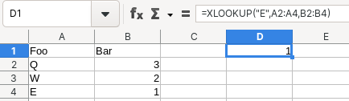
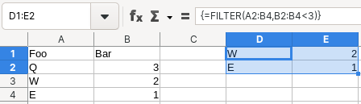
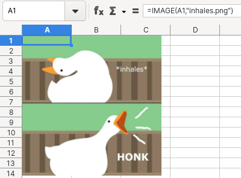
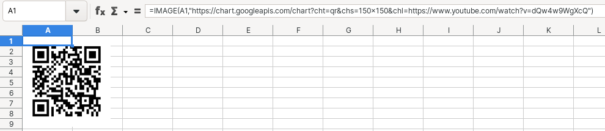
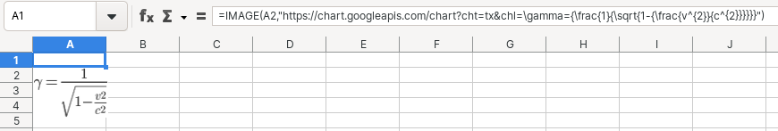
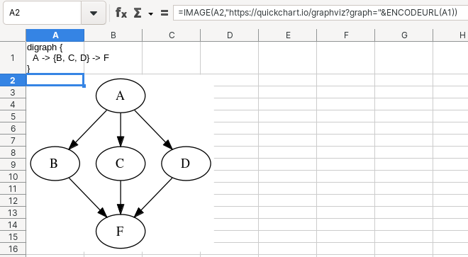
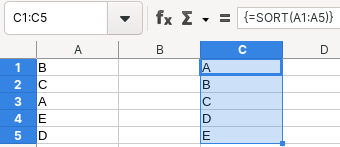
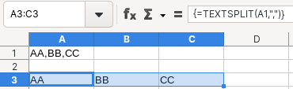
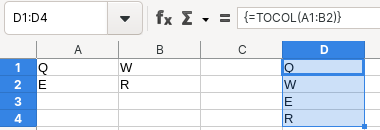
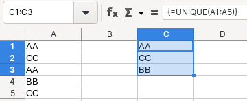

# ⚗️ Lox365: XLOOKUP for LibreOffice

Lox365 is a LibreOffice Calc extension that adds modern spreadsheet functions like XLOOKUP, FILTER, and more.

Do you like using Lox365? Let me know in the [Discussions](https://github.com/goosepirate/lox365/discussions). Maybe [buy me a coffee](https://liberapay.com/goosepirate/).

## Install or update

1. Download the extension `Lox365.oxt` from [Releases](https://github.com/goosepirate/lox365/releases).
2. Start LibreOffice > Tools > Extension Manager > Add > Select the oxt file > restart LibreOffice.

## Usage

Use the function like you would any other function in LibreOffice Calc.

### Multiple outputs

To output results in multiple cells, enter your formula with Ctrl + Shift + Enter.

To edit the formula that is using multiple cells, select the entire cell range first.

This is because Lox365 functions are [array functions](https://help.libreoffice.org/latest/en-US/text/scalc/01/04060107.html). LibreOffice Calc does not support Excel's [dynamic arrays](https://support.microsoft.com/en-us/office/guidelines-and-examples-of-array-formulas-7d94a64e-3ff3-4686-9372-ecfd5caa57c7).

### Syntax

#### FILTER

Filters an array.

Similar to Excel's [FILTER](https://support.microsoft.com/en-us/office/filter-function-f4f7cb66-82eb-4767-8f7c-4877ad80c759).

`=FILTER(array, include, [if_empty])`

* `array`: The array to filter.
* `include`: An array of booleans where TRUE represents a row or column to retain.
* `[if_empty]`: Returned if no items are retained. Optional.

#### IMAGE

Returns an image from a given source.

The source can be a local image file or a web URL. You can use a web URL of a third-party service to generate, for example, a QR code, equation, or diagram.

Similar to Excel's [IMAGE](https://support.microsoft.com/en-us/office/image-function-7e112975-5e52-4f2a-b9da-1d913d51f5d5).

`=IMAGE(out_cell, source)`
* `out_cell`: Reference to the cell where the image is to be placed.
* `source`: The path of the source that points to the image.

#### SORT

Sorts an array.

Similar to Excel's [SORT](https://support.microsoft.com/en-us/office/sort-function-22f63bd0-ccc8-492f-953d-c20e8e44b86c).

`=SORT(array, [sort_index], [sort_order])`
* `array`: The array to sort.
* `[sort_index]`: A number indicating the row or column to sort by. Optional.
* `[sort_order]`: A number indicating the desired sort order; 1 for ascending order (default), -1 for descending order. Optional.
* Not supported: `by_col`.

#### TEXTSPLIT

Splits text into columns using delimiters.

Similar to Excel's [TEXTSPLIT](https://support.microsoft.com/en-us/office/textsplit-function-b1ca414e-4c21-4ca0-b1b7-bdecace8a6e7).

`=TEXTSPLIT(text, col_delimiter)`
* `text`: The text you want to split.
* `col_delimiter`: The text that marks the point where to split the text across columns.
* Not supported: `row_delimiter`, `ignore_empty`, `match_mode`, `pad_with`.

#### TOCOL

Returns the array as one column.

Similar to Excel's [TOCOL](https://support.microsoft.com/en-us/office/tocol-function-22839d9b-0b55-4fc1-b4e6-2761f8f122ed).

`=TOCOL(array)`
* `array`: The array to return as a column.
* Not supported: `ignore`, `scan_by_column`.

#### UNIQUE

Returns the unique values from a range or array.

Similar to Excel's [UNIQUE](https://support.microsoft.com/en-us/office/unique-function-c5ab87fd-30a3-4ce9-9d1a-40204fb85e1e).

`=UNIQUE(array)`
* `array`: The array from which to return unique rows.
* Not supported: `by_col`, `exactly_once`.

#### XLOOKUP

Searches an array for a match and returns the corresponding item from a second array.

Similar to Excel's [XLOOKUP](https://support.microsoft.com/en-us/office/xlookup-function-b7fd680e-6d10-43e6-84f9-88eae8bf5929).

`=XLOOKUP(lookup_value, lookup_array, return_array, [if_not_found])`
* `lookup_value`: The value to search for.
* `lookup_array`: The array to search.
* `return_array`: The array to return.
* `[if_not_found]`: Where a valid match is not found, return the [if_not_found] text you supply. Optional.
* Not supported: `match_mode`, `search_mode`.

## Why

I use these functions quite often in Excel and wanted to use them in LibreOffice too, so I made this.

Here are what others are saying about this project:

> Thanks for this; great idea!

— u/timespreader

> Great work, goose! 😊

— Mike Saunders

> Really nice idea.

— Behzat Yildirim

> Very well done to the creator of the extension.

— Jimmy

> Oh, wonderful!
>
> 😀 Thanks for implementing this!

— Arne

> The support of XLOOKUP is a great addition.

— Marius Spix

> Dobre rozszerzenie, bardzo przydatne funkcje.

— Piotr Osada

> Pues muchísimas gracias.

— Guille

> Bravo!

— Shakir Mahmud Sumon

> The IMAGE function is very useful for those of us that import Google Docs that contain remote (URL base) images.

— René Haché

> Keep up the great work!👍

— LeighAnne Kenney

> 👍😀
>
> A 1000 thanks.

— Mikael Arling

> The idea is splendid because Microsoft's IMAGE function in Excel doesn't work with local pictures or with pictures from LAN shares.

— Gabriela Salvisberg

## Compatibility

Lox365 is not compatible with Microsoft Excel.

Lox365 must be installed in order to read and write Lox365 functions. You can check whether it is installed using LibreOffice Extension Manager.

On a machine without Lox365 installed, you will not be able to view calculation results from Lox365 functions.

## Availability of other functions

These functions are not in LibreOffice and not provided by Lox365 but are available in the latest Excel:

* RANDARRAY
* SEQUENCE
* SORTBY
* STOCKHISTORY
* TOROW
* XMATCH

These functions are not in LibreOffice Calc now, but are planned to be added:

* XLOOKUP

These functions are already available in LibreOffice:

* CONCAT
* IFS
* MAXIFS
* MINIFS
* SWITCH
* TEXTJOIN

## References

### Usage

https://wiki.documentfoundation.org/Documentation/HowTo/install_extension

https://wiki.documentfoundation.org/Feature_Comparison:_LibreOffice_-_Microsoft_Office

### Media

https://blog.documentfoundation.org/blog/2022/09/23/lox365-extension-xlookup-and-more-for-libreoffice-calc/

https://blog.documentfoundation.org/blog/2022/10/06/libreoffice-project-and-community-recap-september-2022/

https://www.reddit.com/r/libreoffice/comments/x98nqt/lox365_xlookup_for_libreoffice/

https://www.reddit.com/r/libreoffice/comments/xltuio/lox365_extension_xlookup_filter_sort_and_more_for/

https://www.reddit.com/r/opensource/comments/xfdmml/lox365_xlookup_for_libreoffice/

https://twitter.com/LibreOffice/status/1573232603351879682

https://fosstodon.org/@libreoffice/109046849962893237

https://www.facebook.com/libreoffice.org/posts/pfbid07mXEodbV2i32W6JkbRYWdDoyw8sUkiw7cX8QdTLU357AhJKGr9QoH5zKeJUxArkzl

[es] https://es.blog.documentfoundation.org/extension-lox365-xlookup-y-mas-para-libreoffice-calc/

[es] https://www.youtube.com/watch?v=BSPCJnc6r2g

[ja] https://forest.watch.impress.co.jp/docs/news/1442776.html

[ja] https://opensource.srad.jp/story/22/09/27/1337200/

[ja] https://www.zaikei.co.jp/article/20220928/691186.html

[pt] https://www.matsuura.com.br/2022/09/extensao-lox365-xlookup-e-mais-para.html

[tr] https://blog.libreoffice.org.tr/2022/09/23/libreoffice-calc-icin-yeni-bir-eklenti-goosepirate/

https://www.ubuntubuzz.com/2023/06/how-to-add-xlookup-function-to-libreoffice-calc.html

https://www.reddit.com/r/libreoffice/comments/16gaeth/lox365_xlookup_and_now_image_for_libreoffice/

https://fosstodon.org/@libreoffice/111052323463423962

https://twitter.com/LibreOffice/status/1701582897784729628

https://www.facebook.com/libreoffice.org/posts/pfbid02882qs7Ek5EZXgSkpkZFMHXCLHszP87pUT8uKcHDpSfwAZfWVytHanGh5fFGocieFl

[zh] https://www.youtube.com/watch?v=ndvbu0kC83o

https://www.youtube.com/watch?v=_zHuJIFLSMw

### Development

https://bugs.documentfoundation.org/show_bug.cgi?id=126573

https://bugs.documentfoundation.org/show_bug.cgi?id=127293

https://gerrit.libreoffice.org/c/core/+/131905

https://flywire.github.io/lo-p/

https://wiki.openoffice.org/wiki/Calc/Add-In/Python_How-To

https://wiki.openoffice.org/wiki/Python/Python_Language_Binding

https://wiki.documentfoundation.org/Documentation/DevGuide/Spreadsheet_Documents

https://help.libreoffice.org/latest/en-US/text/sbasic/python/main0000.html

https://help.libreoffice.org/latest/en-US/text/sbasic/python/python_programming.html

https://www.openoffice.org/api/docs/common/ref/com/sun/star/sheet/module-ix.html

https://www.openoffice.org/api/docs/common/ref/com/sun/star/sheet/AddIn.html

https://git.libreoffice.org/core/

https://forum.openoffice.org/en/forum/

#### LibreOffice API

https://api.libreoffice.org/docs/idl/ref/namespaces.html

https://api.libreoffice.org/docs/idl/ref/interfacecom_1_1sun_1_1star_1_1beans_1_1XPropertySet.html

https://api.libreoffice.org/docs/idl/ref/servicecom_1_1sun_1_1star_1_1sheet_1_1AddIn.html

https://api.libreoffice.org/docs/idl/ref/interfacecom_1_1sun_1_1star_1_1table_1_1XCellRange.html

https://api.libreoffice.org/docs/idl/ref/interfacecom_1_1sun_1_1star_1_1uno_1_1XInterface.html

### Other

https://extensions.libreoffice.org/en/extensions/show/27434

https://bugs.documentfoundation.org/

https://ask.libreoffice.org/

https://forum.openoffice.org/en/forum/index.php

